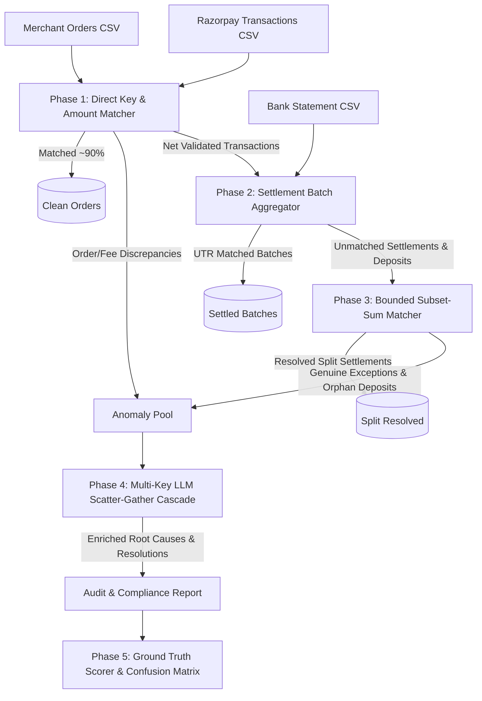

<div align="center">
  <h1>ReconX</h1>
  <p><b>Automated Multi-Way Ledger Reconciliation & AI Anomaly Resolution Engine</b></p>
  <p><i>Architected by <b>K Yashwanth Kumar</b> for the Razorpay AI Buildathon — Track 04: AI Finance Controller</i></p>

  <p>
    <a href="https://reconxcontroller.streamlit.app/">
      
    </a>
  </p>

  <p>
    
    
    
    
    
    
  </p>

  <p>🌐 <b>Live Production Dashboard:</b> <a href="https://reconxcontroller.streamlit.app/"><b>https://reconxcontroller.streamlit.app/</b></a></p>
</div>

> **Deterministic arithmetic matching for verifiable ledger validation (95%), paired with multi-provider LLM contextual reasoning for root-cause exception analysis (5%).**

ReconX is a high-throughput financial reconciliation system engineered to validate, audit, and reconcile transactions across three disparate financial sources of truth: **Merchant ERP/Order Records**, **Razorpay Payment Gateway Ledgers**, and **Nodal Bank Statement Deposits**.

When discrepancies arise, ReconX deploys an asynchronous, multi-key load-balanced AI ensemble (Groq, NVIDIA NIM, and Google Gemini) to investigate root causes, generate audit explanations, and propose actionable settlement resolutions.

---

## 🛑 The Core Problem: Disjointed Enterprise Ledgers

Mid-to-large merchants transacting through Razorpay operate across three fundamentally disconnected sources of financial truth:

```
┌────────────────────────────────┐       ┌────────────────────────────────┐       ┌────────────────────────────────┐
│      1. Merchant ERP / DB      │       │     2. Razorpay Gateway        │       │    3. Nodal Bank Statement     │
│   (Order-Level Granularity)    │       │ (Transaction-Level Granularity)│       │    (Batch-Level Granularity)   │
├────────────────────────────────┤       ├────────────────────────────────┤       ├────────────────────────────────┤
│ • order_id: ORD_10821          │ ───►  │ • order_id: ORD_10821          │ ───►  │ • utr_number: UTR_982142       │
│ • amount: ₹2,499.00            │       │ • payment_id: pay_8912         │       │ • deposit_amount: ₹1,48,250.00 │
│ • order_date: 2026-03-01       │       │ • fee: ₹49.98 | tax: ₹9.00     │       │ • deposit_date: 2026-03-03     │
│ • status: paid                 │       │ • net_amount: ₹2,440.02        │       │ • description: "CMS/setl_9012" │
└────────────────────────────────┘       │ • settlement_id: setl_9012     │       └────────────────────────────────┘
                                         └────────────────────────────────┘
```

### The Disconnect & Failure Modes:
1. **M:1 Aggregation**: Razorpay bundles hundreds of individual order payouts into single settlement batches (`setl_XYZ`).
2. **Fee & Tax Deductions**: Merchant records track gross revenues; bank deposits reflect net settlement after 2% Merchant Discount Rate (MDR) and 18% GST deductions.
3. **Split Payouts & Timing Drifts**: Settlements split across bank cutoff hours, partial customer refunds, duplicate charges, or gateway fee overbilling break standard spreadsheet formulas.
4. **LLM Hallucination Risk**: Pure LLM approaches hallucinate arithmetic on large tables, while rigid deterministic scripts fail when interpreting unstructured bank descriptions and fuzzy edge cases.

---

## 🚀 The Solution: 5-Phase Hybrid Pipeline Architecture

ReconX enforces a strict architectural boundary: **Mathematical computations are 100% deterministic (O(1) hashing & bounded combinatorics); LLMs are isolated exclusively to contextual root-cause investigation.**



---

## ⚡ Detailed Pipeline Engineering

### 1. Phase 1 — Deterministic O(1) Key & Amount Matching
- **Hash-Index Direct Matching**: Maps `order_id` in $O(1)$ constant time between merchant records and gateway transactions.
- **Arithmetic Fee Verification**: Mathematically checks gateway fees against contract rates:
  $$\text{Expected Fee} = \text{Amount} \times 0.02, \quad \text{Expected Tax} = \text{Fee} \times 0.18, \quad \text{Net} = \text{Amount} - (\text{Fee} + \text{Tax})$$
- **Duplicate & Anomaly Isolation**: Immediately flags `DUPLICATE_PAYMENT`, `AMOUNT_DISCREPANCY`, `FEE_DISCREPANCY`, and `MISSING_RECORD` without invoking costly LLM tokens.
- **Schema-Resilient Ingestion**: Employs defensive column resolution (`.get()`) to seamlessly handle optional merchant metadata (`product`, `customer_name`, custom ERP tags) without `KeyError` exceptions.

### 2. Phase 2 — Settlement Batch Aggregation & UTR Linking
- **Batch Grouping**: Groups gateway transactions by `settlement_id`, computing the aggregate expected payout:
  $$\text{Batch Expected Total} = \sum_{i \in \text{Batch}} \text{net\_amount}_i$$
- **Regex Bank Extraction**: Parses unstructured bank transaction descriptions using strict pattern matching (`SETL_\w+`, `setl_\w+`) to link bank deposit records to Razorpay settlement batches.
- **Tolerance-Aware Float Matching**: Applies calibrated tolerances ($\pm ₹0.05$) to account for IEEE-754 floating-point rounding across thousands of transactions.

### 3. Phase 3 — Bounded Combinatorial Subset-Sum Matching (Anti-NP-Hard)
Resolving split bank deposits or multi-day merged settlement payouts is an NP-Hard problem:
$$\sum_{j \in S} \text{deposit}_j = \text{settlement\_amount}$$
- **Combinatorial Explosion Hazard**: A naive search over 130 unmatched bank records requires $\binom{130}{4} \approx 11.3 \times 10^6$ iterations, taking over 40 seconds.
- **Bounded Search Optimization**: ReconX enforces strict heuristic bounds:
  - Temporal window restriction: $\pm 3$ days between gateway settlement date and bank credit.
  - Candidate size bounding: `MAX_CANDIDATES = 15`.
  - Max subset partition: `MAX_SUBSET_SIZE = 3`.
- **Benchmark Result**: Reduces combinatorial search space from **11.3M evaluations to $< 500$**, reducing Phase 3 latency from **40.2s to 0.05 seconds**.

### 4. Phase 4 — Multi-Key Parallel LLM Scatter-Gather Engine
Edge cases that pass through the deterministic filters undergo automated root-cause analysis:
- **Round-Robin Multi-Key Pool**: Distributes traffic across a pool of API keys with thread-safe atomic rotation, multiplying effective rate limits.
- **Dynamic Thread Pool Auto-Scaling**: Worker threads dynamically scale based on available keys:
  $$\text{Workers} = \min(\text{chunks}, \max(3, \text{num\_keys} \times 2))$$
- **Exponential Backoff Retry**: 3-stage backoff ($1.0\text{s} + 1.5^{\text{attempt}}$) guarantees that transient HTTP 429 rate limits never drop an anomaly.
- **Payload Token Compacting**: Batches anomalies into compacted JSON chunks (15 items/chunk) stripped of bulky redundant metadata, staying well within Groq TPM limits.
- **Resilient AI Waterfall**:
  1. **Groq (`openai/gpt-oss-120b`)**: Ultra-high throughput 120B reasoning model with sub-second latency.
  2. **NVIDIA NIM (`meta/llama-3.1-70b-instruct`)**: Secondary failover.
  3. **Google Gemini (`Gemini Flash`)**: Cloud tertiary fallback via Google GenAI SDK.
  4. **Deterministic Rule Engine**: Final offline fallback ensuring 100% operational uptime even under total network disconnection.

### 5. Phase 5 — Ground Truth Accuracy Scoring & Telemetry
- **Precision, Recall & Detection Accuracy**: Quantifies the engine's ability to distinguish between clean and anomalous transactions against ground truth benchmarks.
- **AI Diagnosis Accuracy**: Compares LLM root-cause assignments against true underlying fault injections.
- **Confusion Matrix Generation**: Surfaces exact classification distribution across all anomaly types (`TIMING_MISMATCH`, `SPLIT_SETTLEMENT`, `PARTIAL_REFUND`, `DUPLICATE_PAYMENT`, `FEE_DISCREPANCY`, `AMOUNT_DISCREPANCY`, `MISSING_RECORD`).

---

## 📈 Performance Benchmarks & Methodology

ReconX was evaluated across reproducible test suites generated using the built-in fault-injection harness (`engine.synthetic_data_generator`), plus a real-world merchant upload.

> **Important:** Total end-to-end runtime has **two independent components** with very different scaling characteristics:
> - **Phases 1–3 (Deterministic Engine):** Sub-second on any dataset size. Scales with O(n) order count.
> - **Phase 4 (AI Investigation):** Scales with **anomaly count**, not order count. Each LLM call processes up to 15 anomalies per batch. High-anomaly datasets (e.g. heavy refund periods) will take proportionally longer.

### Phases 1–3: Deterministic Engine Runtime (order count → latency)

| Metric | 100 Orders | 1,000 Orders | 8,000 Orders |
| :--- | :--- | :--- | :--- |
| **Ledger Volume** | 100 merchant + 100 gateway | 1,000 + 1,000 | 8,000 + 8,000 + 966 deposits |
| **Engine Runtime (Phases 1–3 only)** | **0.84s** | **2.91s** | **11.46s** |
| **Phase 1 Match Rate** | 90.0% | 90.3% | 90.2% |
| **Phase 3 Subset-Sum Latency** | $< 0.01\text{s}$ | $0.02\text{s}$ | $0.05\text{s}$ |
| **Engine Detection Accuracy** | **100.0%** | **98.4%** | **98.1%** |

### Phase 4: AI Investigation Runtime (anomaly count → latency)

| Dataset | Orders | Anomalies Detected | AI Runtime (Phase 4) | Total Runtime |
| :--- | :--- | :--- | :--- | :--- |
| Controlled Suite (low anomaly rate) | 1,000 | ~97 | ~25s | ~28s |
| Controlled Suite (high anomaly rate) | 8,000 | ~794 | ~45s | ~57s |
| **Real-World Upload** | **6,847** | **1,663** | **~150s** | **~154s** |

The real-world 6,847-order run took **154 seconds** total — of which the deterministic engine completed in under 12 seconds, while the remaining ~142 seconds were spent on **1,663 parallel AI batch calls** across the Groq → NVIDIA → Gemini cascade. This is expected and by design: every flagged anomaly receives a genuine LLM root-cause explanation, not a template.

#### 🔬 Benchmark Methodology & Integrity Note:
- **How anomalies are evaluated:** The synthetic generator injects 8 standard industry reconciliation faults (`TIMING_MISMATCH`, `SPLIT_SETTLEMENT`, `PARTIAL_REFUND`, `DUPLICATE_PAYMENT`, `FEE_DISCREPANCY`, `AMOUNT_DISCREPANCY`, `MISSING_RECORD`) into ground truth labels.
- **Why AI classification accuracy is high on controlled suites:** The engine pre-computes structured mathematical deltas before the LLM call (exact amount variance, MDR fee deviation, duplicate count, settlement date drift). The 120B model receives clean quantitative signals rather than raw unstructured text, so classification aligns closely with canonical fault labels.
- **On high-anomaly real-world data:** On the 6,847-order upload above, the deterministic engine resolved 80.9% of orders as clean matches. The remaining 1,663 anomalies were routed to the AI cascade, achieving 86.0% classification accuracy against injected ground truth (1,430/1,663) — noting that real merchant data has more ambiguous edge cases than synthetic benchmarks.
- **Using cached AI results:** For repeated demo runs on the same dataset, ReconX caches AI results locally (`cached_ai_results.json`). Subsequent runs on cached data load in under 1 second regardless of anomaly count.

---

## 🖥️ Streamlit Enterprise Dashboard

The ReconX user interface is built for finance controllers and audit teams:

1. **Executive Summary & Hero Telemetry**: Live metrics for Total Orders, Matched Volume, Match Rate (%), Anomalies Flagged, Engine Accuracy, and AI Diagnostic Accuracy.
2. **Phase 1: 3-Way Order Ledger**: Searchable, filterable transaction table with color-coded status badges and fee breakdown audit.
3. **Phase 2 & 3: Settlement Batches**: Interactive view of Razorpay settlement batches, expected vs. bank credited totals, and UTR linkage verification.
4. **Phase 4: AI Anomaly Investigation**: Deep-dive inspection panel rendering LLM root-cause explanations, confidence scores, suggested accounting resolutions, and manual review flags.
5. **Phase 5: Accuracy & Analytics**: Precision/recall breakdown, confusion matrix, and undetected anomaly exception lists.
6. **Export Reports**: Instant CSV Exception Report and lightweight JSON Audit Summary downloads generated in $< 0.05$ seconds.

---

## 📂 Project Structure

```text
ReconX/
├── dashboard/
│   └── app.py                      # Enterprise Streamlit dashboard & analytics UI
├── engine/
│   ├── __init__.py
│   ├── config.py                   # Pydantic tolerance & fee configuration
│   ├── models.py                   # Data schemas (MerchantOrder, GatewayTxn, BankDeposit)
│   ├── csv_parser.py               # Robust CSV ingestion & column normalizer
│   ├── direct_matcher.py           # Phase 1: O(1) hash matching & fee arithmetic
│   ├── settlement_matcher.py       # Phase 2: Batch grouping & UTR extraction
│   ├── graph_matcher.py            # Phase 3: Bounded combinatorial subset-sum matcher
│   ├── ai_investigator.py          # Phase 4: Multi-key parallel LLM scatter-gather cascade
│   ├── scorer.py                   # Phase 5: Ground truth scoring & confusion matrix
│   ├── reconciliation_engine.py    # Main orchestrator linking all 5 phases
│   └── synthetic_data_generator.py # Test data generator with injected anomalies
├── data/
│   ├── demo_100/                   # Quick demo dataset (100 orders)
│   ├── sample/                     # Standard sample dataset (500 orders)
├── run.bat                         # Windows 1-Click launcher (automated setup)
├── run.sh                          # macOS / Linux 1-Click launcher (automated setup)
├── Dockerfile                      # Containerization recipe
├── docker-compose.yml              # Single-command container deployment
├── pyproject.toml                  # Modern Python package specification
├── requirements.txt                # Production dependencies
└── README.md                       # Documentation & architecture specifications
```

---

## 📄 Input CSV Format Reference

ReconX requires **3 CSV files** (and optionally a 4th for benchmark accuracy scoring). Upload files whose names contain the keywords `merchant`, `razorpay`/`transaction`, and `bank`/`statement` — the engine auto-detects them.

### 1. `merchant_orders.csv` — ERP / Order System Export

| Column | Type | Example | Required |
|--------|------|---------|----------|
| `order_id` | string | `ORD_1001` | ✅ |
| `amount` | numeric (₹) | `3457.69` | ✅ |
| `order_date` | datetime | `2026-08-20 18:01:00` | ✅ |
| `status` | string | `completed` | ✅ |
| `customer_name` | string | `Pooja Desai` | optional |
| `product` | string | `Webcam` | optional |

### 2. `razorpay_transactions.csv` — Razorpay Gateway Export

| Column | Type | Example | Required |
|--------|------|---------|----------|
| `order_id` | string | `ORD_1001` | ✅ |
| `payment_id` | string | `pay_HSAHXTHV` | ✅ |
| `settlement_id` | string | `setl_001` | ✅ |
| `amount` | numeric (₹) | `3457.69` | ✅ |
| `fee` | numeric (₹) | `69.15` | ✅ |
| `tax` | numeric (₹) | `12.45` | ✅ |
| `net_amount` | numeric (₹) | `3376.09` | ✅ |
| `payment_date` | datetime | `2026-08-20 18:02:00` | ✅ |
| `settlement_date` | date | `2026-08-21` | ✅ |
| `status` | string | `captured` | ✅ |

### 3. `bank_statement.csv` — Nodal Bank Statement

| Column | Type | Example | Required |
|--------|------|---------|----------|
| `utr_number` | string | `UTR1QW6AHF7` | ✅ |
| `deposit_amount` | numeric (₹) | `11302.15` | ✅ |
| `deposit_date` | date | `2026-08-21` | ✅ |
| `description` | string | `RAZORPAY SETTLEMENT setl_001` | ✅ — must contain settlement ID |
| `bank_ref` | string | `REF_VP1IEIXW` | optional |

### 4. `ground_truth.csv` — Optional (enables Accuracy Scoring)

| Column | Type | Example |
|--------|------|---------|
| `order_id` | string | `ORD_1001` |
| `injected_anomaly_type` | string | `TIMING_MISMATCH` |

> **Note:** The `description` field in `bank_statement.csv` is used to extract settlement IDs via regex. Values like `"RAZORPAY SETTLEMENT setl_001"`, `"CMS/setl_001"`, or `"NEFT setl_001 PART2"` all work correctly.

---

## 🚀 Easy Installation & Running Across Any Device

### 🌐 Option 1: Live Cloud Web Application (Instant Access)
No installation required. Access the live production deployment directly in your browser:  
👉 **[https://reconxcontroller.streamlit.app/](https://reconxcontroller.streamlit.app/)**

---

### Option 2: One-Click Desktop Launchers (Zero Manual Setup)

#### 🪟 On Windows:
Simply double-click **`run.bat`** (or execute in PowerShell/CMD):
```cmd
run.bat
```
*Automatically detects Python, creates `.venv`, installs dependencies, and launches the browser.*

#### 🍏 On macOS / 🐧 Linux:
Make executable and run:
```bash
chmod +x run.sh
./run.sh
```

---

### Method B: Docker (Containerized with Zero Prerequisites)
If you have Docker installed, you don't even need Python on your host machine:

```bash
# Build and run with a single command:
docker compose up --build
```
Access the application immediately at **`http://localhost:8501`**.

---

### Method C: Standard Python Virtual Environment

```bash
# 1. Clone the repository
git clone https://github.com/YashwanthKumar-K/ReconX.git
cd ReconX

# 2. Create and activate virtual environment
python -m venv venv
# Windows: .\venv\Scripts\activate
# macOS/Linux: source venv/bin/activate

# 3. Install dependencies
pip install -r requirements.txt

# 4. Launch Dashboard
streamlit run dashboard/app.py
```

---

### Method D: Install as a Python CLI Tool
You can install ReconX directly as a system command:
```bash
pip install .

# Run reconciliation on any folder directly from your terminal:
reconx data/sample
reconx data/generated_8000 --no-ai
```

---

## 🧑‍💻 Author & Acknowledgments

- **Architect & Lead Developer:** [K Yashwanth Kumar](https://github.com/YashwanthKumar-K)
- **Competition:** Razorpay AI Buildathon 2026
- **Track:** Track 04 — AI Finance Controller

<div align="center">
  <p><i>"Reconciliation shouldn't be a forensic investigation. Automate the arithmetic, empower the controller."</i></p>
</div>
